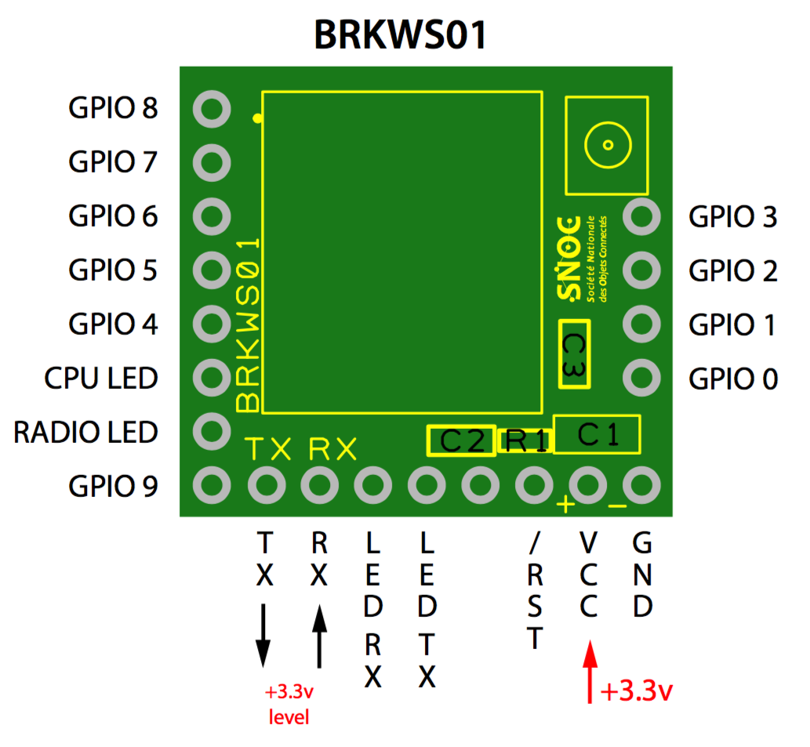

Eloquent library for Wisol WSSFM10 Sigfox Module
==============================================================
# Usage
## Pin connection

Connect breakout board to the Arduino as this:

* Board -> Arduino
* 3,3V  ->  3,3V
* GND   ->  GND
* RX    ->  11
* TX    ->  10

## API

 * `dumpInfo`: get a string with ID and PAC
 * `wakeup`: wake module up from software reset mode
 * `getID`
 * `getPac`
 * `getTemp`
 * `setPowerMode(uint8_t mode)`: mode can be 0, 1, 2 or one of the class constants SOFTWARE_RESET, SLEEP, DEEP_SLEEP
 * `enableSoftwareResetMode`: short for `setPowerMode(0)`
 * `enableSleepMode`: short for `setPowerMode(1)`
 * `enableDeepSleepMode`: short for `setPowerMode(2)`
 * `setOutputPower(uint8_t power)`
 * `cmd(String cmd)`: send a string to the module and get the response
 * `read(uint16_t timeout = 15000)`: get module response, within the timeout. An empty string is returned if timeout
 * `send(const void* data, uint8_t size, bool ack = true)`: send message to the Sigfox cloud. Returns true if successful

## Example

##### With SoftwareSerial

```cpp
#include <SoftwareSerial.h>
#include <Wisol.h>

typedef struct {
  uint8_t counter;
} Payload;

SoftwareSerial stream(10, 11);
Wisol sigfox(&stream);

void setup() {
  Serial.begin(115200);
  delay(3000);
  stream.begin(9600);
}

void loop() {
  Payload p = { rand() * 100 };
  
  Serial.println(sigfox.dumpInfo());
  Serial.print("Temp: "); Serial.println(sigfox.getTemp());
  Serial.print("Send: "); Serial.println(sigfox.send(&p, sizeof(p)) ? "OK" : "ERR");
  delay(30000);
}
```

##### With HardwareSerial (ESP32)

```cpp
#include <HardwareSerial.h>
#include <Wisol.h>

typedef struct {
  uint8_t counter;
} Payload;

HardwareSerial stream(1);
Wisol sigfox(&stream);

void setup() {
  Serial.begin(115200);
  delay(3000);
  stream.begin(9600, SERIAL_8N1, 18, 19);
}

void loop() {
  Payload p = { rand() * 100 };
  
  Serial.println(sigfox.dumpInfo());
  Serial.print("Temp: "); Serial.println(sigfox.getTemp());
  Serial.print("Send: "); Serial.println(sigfox.send(&p, sizeof(p)) ? "OK" : "ERR");
  delay(30000);
}
```